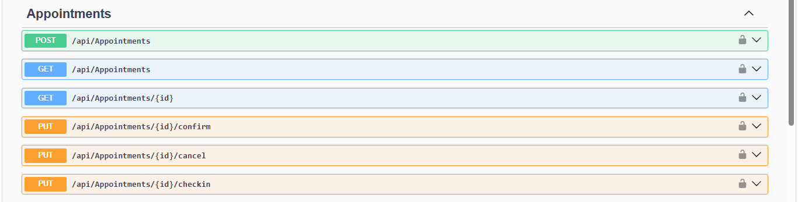
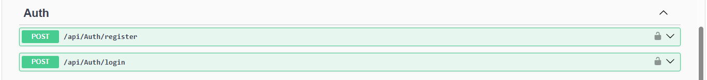
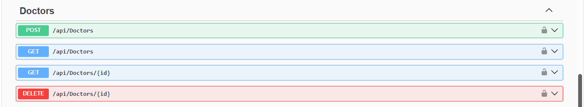
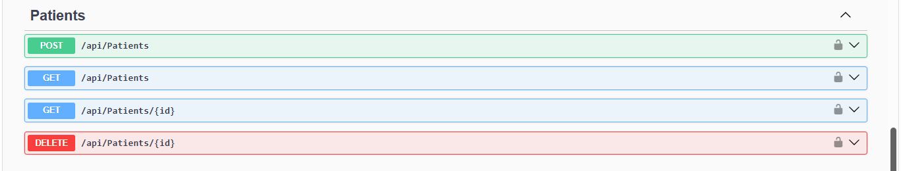
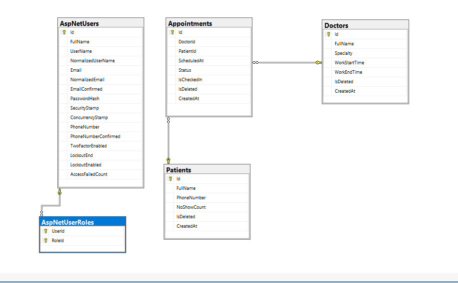
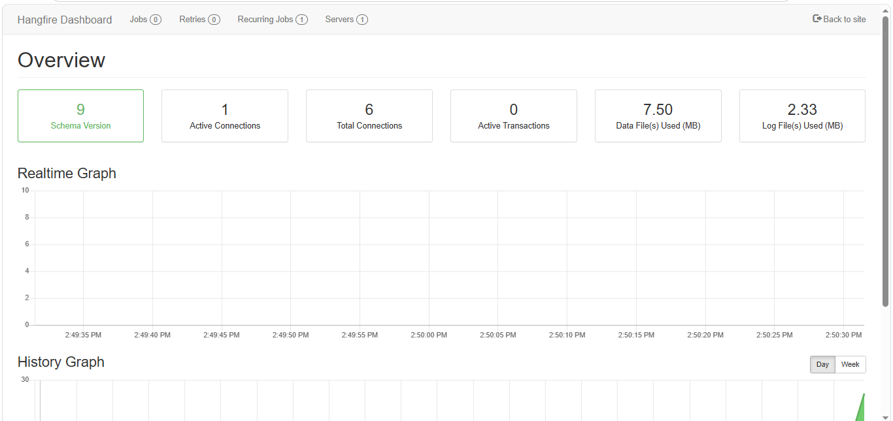

# 🏥 Clinic Booking System API

A production-ready RESTful API for managing clinic appointments, built with **ASP.NET Core 8**, **Clean Architecture**, and **Hangfire Background Jobs**.

---

## 📌 Project Overview

This system solves real-world clinic management problems:

- Patients can book appointments with doctors
- Unconfirmed appointments are automatically cancelled after 1 hour
- Patients receive automatic reminders 1 hour before their appointment
- No-show patients are automatically detected 15 minutes after their appointment time

---

## 🏗️ Architecture

The project follows **Clean Architecture** with strict separation of concerns across 4 layers:

```
ClinicBookingSystem/
├── ClinicBooking.Domain          # Entities, Enums, Interfaces, Exceptions
├── ClinicBooking.Application     # CQRS (Commands/Queries), DTOs, Validators, Behaviors
├── ClinicBooking.Infrastructure  # EF Core, Repositories, Hangfire, Identity, JWT
└── ClinicBooking.API             # Controllers, Middleware, Swagger, Program.cs
```

### Dependency Flow:

```
API → Infrastructure → Application → Domain
```

---

## 🛠️ Tech Stack

| Layer           | Technologies                         |
| --------------- | ------------------------------------ |
| Framework       | ASP.NET Core 8                       |
| Architecture    | Clean Architecture, CQRS             |
| ORM             | Entity Framework Core 8 + SQL Server |
| Mediator        | MediatR                              |
| Validation      | FluentValidation (Pipeline Behavior) |
| Mapping         | AutoMapper                           |
| Background Jobs | Hangfire                             |
| Authentication  | ASP.NET Core Identity + JWT Bearer   |
| Documentation   | Swagger / OpenAPI                    |

---

## ✨ Features

### Core CRUD

- **Doctors** — Create, Read, Update, Delete (Soft Delete)
- **Patients** — Create, Read, Update, Delete (Soft Delete)
- **Appointments** — Create, Read, Cancel, Confirm, Check-In

### Business Rules

- ✅ **Double Booking Prevention** — A doctor can't have two appointments at the same time slot
- ✅ **Appointment State Machine** — Strict status transitions (Pending → Confirmed → Completed / Cancelled / NoShow)
- ✅ **Soft Delete** with Global Query Filters — Deleted records are hidden automatically from all queries
- ✅ **Role-Based Authorization** — Admin and Patient roles with different permissions

### 🔔 Background Jobs (Hangfire)

| Job                  | Type                     | Description                                                                 |
| -------------------- | ------------------------ | --------------------------------------------------------------------------- |
| Auto-Cancel          | Recurring (every minute) | Cancels unconfirmed appointments after 1 hour                               |
| Appointment Reminder | Delayed                  | Sends a reminder 1 hour before the appointment                              |
| No-Show Detection    | Delayed                  | Marks appointments as NoShow 15 minutes after scheduled time if no check-in |

---

## 🔐 Authentication & Authorization

JWT Authentication with Role-Based Authorization:

| Endpoint                           | Anonymous | Patient | Admin |
| ---------------------------------- | --------- | ------- | ----- |
| GET /api/Doctors                   | ✅        | ✅      | ✅    |
| POST /api/Doctors                  | ❌        | ❌      | ✅    |
| DELETE /api/Doctors/{id}           | ❌        | ❌      | ✅    |
| GET /api/Appointments              | ❌        | ✅      | ✅    |
| POST /api/Appointments             | ❌        | ✅      | ✅    |
| PUT /api/Appointments/{id}/confirm | ❌        | ❌      | ✅    |
| PUT /api/Appointments/{id}/cancel  | ❌        | ✅      | ✅    |
| GET /api/Patients                  | ❌        | ❌      | ✅    |

---

## 🚀 Getting Started

### Prerequisites

- .NET 8 SDK
- SQL Server (or SQL Server Express)
- Visual Studio 2026

### Setup

**1. Clone the repository**

```bash
https://github.com/mohamed-eltohami/ClinicBooking.API.git
cd ClinicBookingSystem
```

**2. Update Connection String**

In `ClinicBooking.API/appsettings.json`:

```json
{
  "ConnectionStrings": {
    "DefaultConnection": "Server=.\\SQLEXPRESS;Database=ClinicBookingDb;Trusted_Connection=True;TrustServerCertificate=True"
  },
  "JwtSettings": {
    "Key": "YOUR_JWT_SECRET_KEY",
    "Issuer": "ClinicBookingSystem",
    "Audience": "ClinicBookingSystemUsers",
    "ExpiryMinutes": 60
  }
}
```

**3. Apply Migrations**

```bash
cd ClinicBooking.Infrastructure
dotnet ef database update --startup-project ../ClinicBooking.API
```

**4. Run the project**

```bash
cd ClinicBooking.API
dotnet run
```

**5. Open Swagger**

```
https://localhost:7215/swagger
```

**6. Open Hangfire Dashboard**

```
https://localhost:7215/hangfire
```

---

## 📸 Screenshots

### Swagger API Documentation






### Database Diagram



### Hangfire Dashboard



---

## 📡 API Endpoints

### Auth

| Method | Endpoint           | Description                            |
| ------ | ------------------ | -------------------------------------- |
| POST   | /api/Auth/register | Register a new user (Admin or Patient) |
| POST   | /api/Auth/login    | Login and get JWT token                |

### Doctors

| Method | Endpoint          | Auth   |
| ------ | ----------------- | ------ |
| GET    | /api/Doctors      | Public |
| GET    | /api/Doctors/{id} | Public |
| POST   | /api/Doctors      | Admin  |
| DELETE | /api/Doctors/{id} | Admin  |

### Patients

| Method | Endpoint           | Auth  |
| ------ | ------------------ | ----- |
| GET    | /api/Patients      | Admin |
| GET    | /api/Patients/{id} | Admin |
| POST   | /api/Patients      | Admin |
| DELETE | /api/Patients/{id} | Admin |

### Appointments

| Method | Endpoint                       | Auth           | Description            |
| ------ | ------------------------------ | -------------- | ---------------------- |
| GET    | /api/Appointments              | Authenticated  | Get all appointments   |
| GET    | /api/Appointments/{id}         | Authenticated  | Get appointment by id  |
| POST   | /api/Appointments              | Authenticated  | Create new appointment |
| PUT    | /api/Appointments/{id}/confirm | Admin          | Confirm appointment    |
| PUT    | /api/Appointments/{id}/cancel  | Admin, Patient | Cancel appointment     |
| PUT    | /api/Appointments/{id}/checkin | Admin          | Check-in patient       |

---

## 🧪 Testing the Background Jobs

### Auto-Cancel Job

1. Create an appointment (POST /api/Appointments) — leave it as Pending
2. Wait 1 hour (or temporarily change `AddHours(-1)` to `AddSeconds(10)` for testing)
3. The appointment status will change to `Cancelled` automatically

### Reminder & No-Show Jobs

After creating an appointment, check the Hangfire Dashboard at `/hangfire` → **Scheduled Jobs**:

- A **Reminder Job** scheduled 1 hour before the appointment
- A **No-Show Job** scheduled 15 minutes after the appointment

---

## 📐 Design Patterns Used

- **Clean Architecture** — Separation of concerns across 4 layers
- **CQRS** — Commands and Queries separated via MediatR
- **Repository Pattern** — Abstraction over data access
- **Unit of Work** — Coordinates multiple repositories in a single transaction
- **Pipeline Behavior** — FluentValidation runs automatically before every Command
- **Factory Pattern** — `IDesignTimeDbContextFactory` for EF Core migrations
- **Strategy Pattern** — `INotificationService` abstraction for future Email/SMS integration

---

## 👨‍💻 Author

**Mohamed Reda Mohamed**
Junior .NET Backend Developer

- 📧 mo.reda.eltohamy@gmail.com
- 🔗 [LinkedIn](https://www.linkedin.com/in/mohamed-reda-altohamy)
